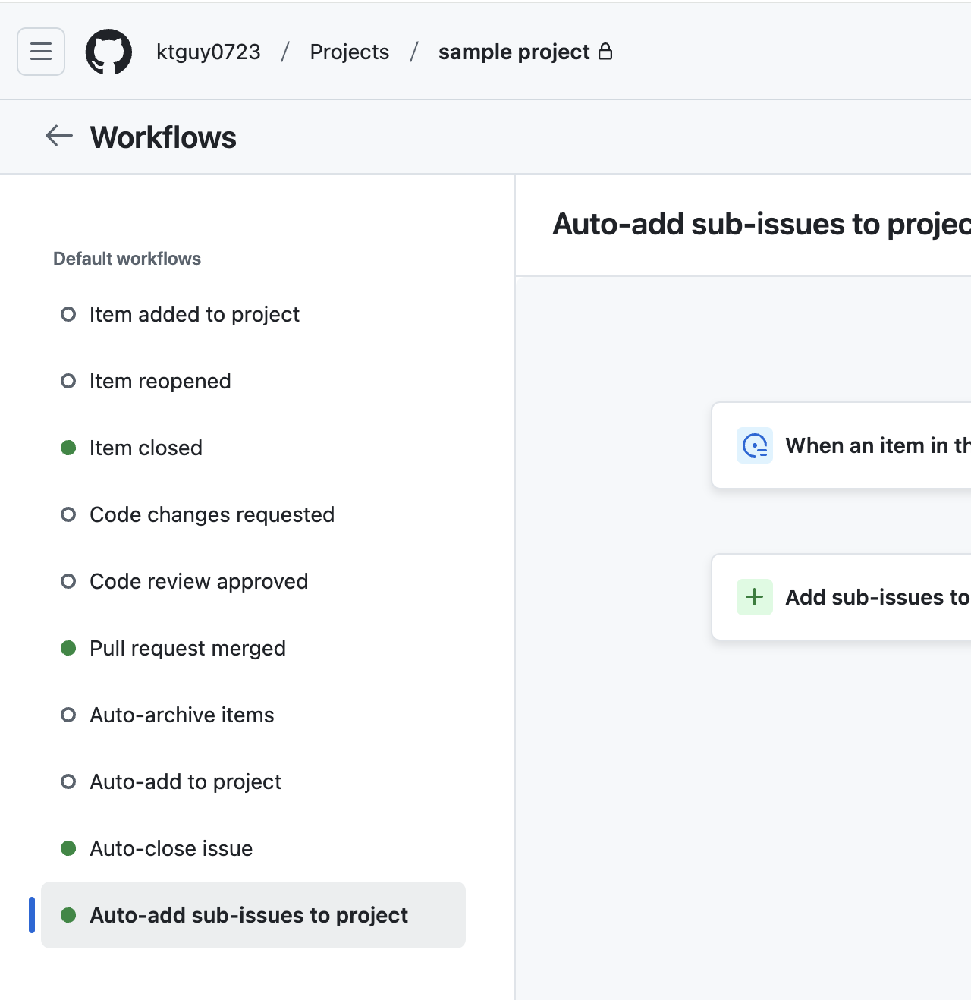
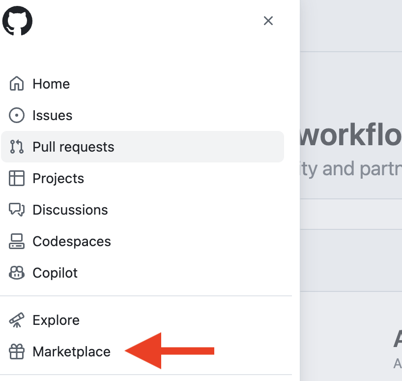
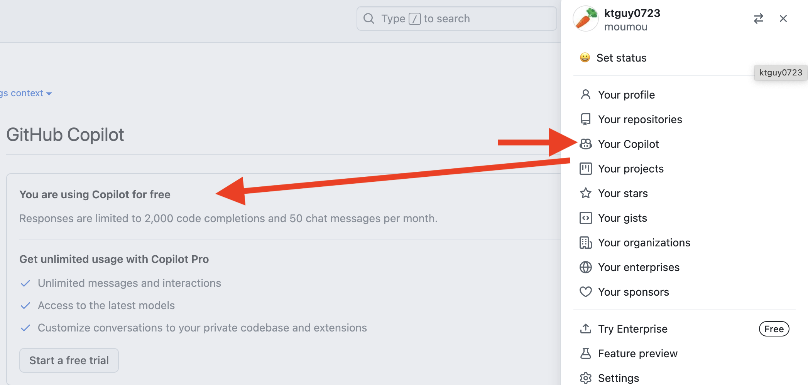
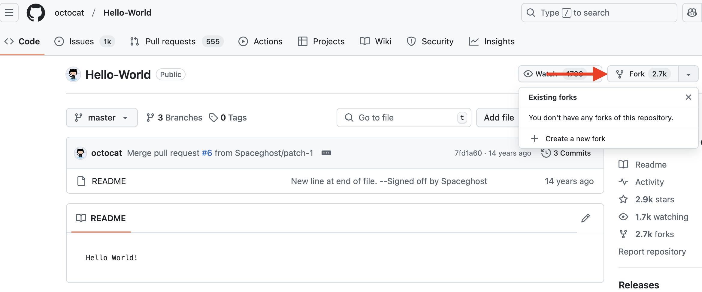

https://ghcertified.com/questions/

## 問題1 
- [x] GitHubアカウントの種類（3種類）
### 解説
- Personal accounts(個人アカウント)
  - 個人が使用するアカウント
  - 無料プランや有料プランがあり、プライベートリポジトリやチーム向けの機能も利用可能
  - 
- Organization accounts(組織アカウント)
  - チームや企業が共同作業をするためのアカウント
  - メンバー管理やリポジトリの権限設定など、チーム向けの機能が充実
  - 無料プラン、有料プランがある
  - 
  - https://genesis-tech.jp/blog/create-github-organization/
- Enterprise accounts(エンタープライズアカウント)
  - 大規模な企業向けのアカウント
  - GitHub Enterprise Cloud や GitHub Enterprise Server を利用できる

## 問題2
- [x] 適応性の高いスプレッドシート、タスク ボード、ロードマップの目的を果たすものはどれですか。GitHubの問題やプルリクエストと統合され、作業を効果的に計画および追跡します。
### 解説
- GitHub Project
  - 従来の Projects (Classic) から進化し、より柔軟にタスク管理ができる
  - 企業や個人がIssueやPullRequestと連携してプロジェクト管理を行うのに最適なツールです
  - 

## 問題3
- [x] GitHubプロジェクト、問題、プルリクエスト間の同期はどのように機能しますか?
### 解説
- IssueやPull Requestの更新はGitHub Projectsに自動的に反映され、逆方向の同期も行われる。

## 問題4
- [x] GitHubプロジェクトのアイテムのカスタムフィールドの追加の際の特徴は?
### 解説
- カスタムフィールドを使用すると、ターゲット日付やイテレーションなど、組み込みオプション以外のメタデータを追加できます。

## 問題5
- [x] GitHubプロジェクトボードに問題やプルリクエストを追加するために使用できるさまざまなオプションは何ですか?
### 解説
- 個別・・・必要な Issue や Pull Request を手動で選択し、プロジェクトに追加
- 自動・・・プロジェクトワークフロー を設定すると、特定の条件を満たす Issue や Pull Request を自動でプロジェクトに追加
- 一括・・・複数の Issue や Pull Request を 一括選択して追加

## 問題6
- [x] GitHub Projectで使用できるレイアウトはどれですか?
### 解説
- Table layout
  - 
- Board layout
  - 
- Roadmap layout
  - 

## 問題7
- [x] どのGitHub Projectレイアウトがカンバンボードとして最適ですか?
### 解説
- Board layout

## 問題8
- [x] GitHub Projectに組み込まれているステータスの自動化は何か?
### 解説
- Project内の問題またはプルリクエストがクローズ→ステータス完了
- Project内のプルリクエストがマージ→ステータス完了
- 

## 問題9
- [x] GitHubプロジェクトでの操作を自動化できるオプションは何ですか?
### 解説
- Project workflows
  - GitHub Projects の組み込み機能で、特定の条件を満たしたときに自動でアクションを実行
- GitHub Actions
  - GitHub の CI/CD 自動化ツールを使って、プロジェクトのワークフローをさらに拡張できる
- GitHub GraphQL API (API連携)
  - API を使ってプログラムでプロジェクトを操作できる

## 問題10
- [x] GitHubプロジェクトと GitHubプロジェクトクラシックの違いは何ですか?
### 解説
- GitHubプロジェクトは、従来のGitHubプロジェクトに比べて多くの新機能と改善点を提供する新しいGitHubエクスペリエンス

## 問題11
- [x] ラベルの使用例は何ですか?
### 解説
- イシュー、プルリクエスト、ディスカッションの分類
- 

## 問題12
- [x] リポジトリ所有者がマイルストーンを使用する理由は何ですか?
### 解説
- プロジェクトフェーズを完了するためにどれだけの作業が残っているかの概要を把握する
- イシューとプルリクエストを特定のプロジェクトフェーズに関連付ける
- イシュー、プルリクエストの画面から作成することができる
- 

## 問題13
- [x] 問題またはプルリクエストに人を割り当てるにはどうすればよいですか?
### 解説
- サイドバーの担当者フィールドを使用する
- 

## 問題14
- [x] 問題またはプルリクエストに同じコメントセットを頻繁に書き込む場合、時間を節約するためにどのGitHub機能を使用しますか?
### 解説
- 返信テンプレート
- users > settingsから作成できる
- 

## 問題15
- [x] 「保存された返信」はどこで作成され、どこで利用できるか?
### 解説
- 保存された返信は、GitHub アカウント設定の [保存された返信] セクションで作成、編集、削除できる
- 保存された返信は、イシューやプルリクエストで再利用できる

## 問題16
- [x] リポジトリテンプレートに関して実行できるアクションにはどのようなものがありますか?
### 解説
- リポジトリテンプレートから新しいリポジトリを作成する
- 既存のリポジトリからリポジトリテンプレートを作成する
- 

## 問題17
- [x] GitHubプロジェクトのどの機能を使用すると、プロジェクトの現在のステータスと履歴の進行状況を視覚化するためのグラフとチャートを簡単に生成できますか?
### 解説
- Project Insights
  - Project Insightsは、GitHub Projects 内でプロジェクトの進捗やタスクの状態を可視化するための機能
  - グラフやチャートを自動生成し、現在の状態や過去の履歴を簡単に確認できる
  - 

## 問題18
- [x] GitHubの継続的インテグレーションおよび継続的デリバリー (CI/CD) プラットフォームの名前は何ですか?
### 解説
- GitHub Actions
  - `/.github/workflows/`に`.yml`ファイルとしてワークフローの設定ファイルが格納される

## 問題19
- [x] GitHub Actionsの一般的な使用例は何か?
### 解説
- プルリクエストをマージする前に自動テストを実行する

## 問題20
- [x] GitHub Action ワークフローはイベントによってトリガーされます。GitHub Actions がサポートする主要なイベントは何か?(2つ)
### 解説
- コミットがブランチにプッシュされた
- プルリクエストが開かれた
- https://docs.github.com/en/actions/using-workflows/events-that-trigger-workflows#about-events-that-trigger-workflows

## 問題21
- [x] 公開されている GitHub Actions はどこにありますか?
### 解説
- GitHub Marketplace
  - 左上のアイコン > Marcketplaceからアクセスできる
  - 

## 問題22
- [x] 次のツールのうち、コード入力時にオートコンプリートスタイルの提案を提供するAIペアプログラマーとして機能するものはどれですか?
### 解説
- GitHub Copilot
  - VSCodeで使用する場合は`GitHub Copilot`拡張機能をインストールする
  - 
  - 利用状況や利用プランはsettingsから確認可能
  - 

## 問題23
- [x] GitHub Copilotは無料で使用できますか?
### 解説
- 認証済みの学生、教師、または人気のあるオープンソースプロジェクトのメンテナーであれば無料
- 無料プランは、1か月あたり 2,000 回のコード補完と 50 件のチャットメッセージに制限

## 問題24
- [x] GitHub Copilot IndividualとGitHub Copilot Businessの違いは何ですか?
### 解説
- GitHub Copilot Individual:
  - 個人アカウント向けのプラン
  - 個人ユーザーが VS Code や JetBrains などで AI 補完を利用可能
  - 価格: $10/月（または $100/年）（学生・教育者・OSSメンテナーは無料）
- GitHub Copilot Business:
  - 企業や組織向けのプラン
  - 組織内のメンバーが Copilot を利用できるようにライセンス管理可能
  - 価格: $19/ユーザー/月
  - データの取り扱いが異なり、企業のコードを学習データとして利用しない（セキュリティ面での配慮）。

## 問題25
- [x] GitHub Copilotサブスクリプションをアクティブ化した後、どのようにして GitHub Copilot の使用を開始できますか?
### 解説
- Visual Studio CodeやJetBrainsなどのサポートされているIDEのいずれかでGitHub Copilotをセットアップし、コーディングを開始

## 問題26
- [x] GitHub Codespace とは何ですか?
### 解説
- リポジトリ専用に設定された事前構成済みの開発環境
- ローカル開発環境を設定しなくても、プロジェクトのコードをすぐに書き始めることができる
- 

## 問題27
- [x] リポジトリへの貢献に必要なすべてのツールと依存関係がインストールされた、事前構成された開発環境を作成できる GitHubの機能はどれですか?
### 解説
- GitHub Codespaces
  - 開発者がすぐにコーディングを開始できる「事前構成された開発環境」を提供する機能

## 問題28
- [x] リポジトリ貢献者が Web ブラウザーから直接簡単なコード変更を行える GitHub の機能はどれですか?
### 解説
- GitHub Codespaces
  - クラウドベースの VS Code 環境で、より高度なコード編集が可能
  - リポジトリごとに事前構成された開発環境をセットアップでき、依存関係もインストールされた状態で作業できる
  - github.dev よりも強力で、フル機能の IDE 環境を提供
  - ブラウザまたはローカルの VS Code からアクセス可能
- github.dev editor
  - GitHub の Web エディタ（github.dev）を使えば、ブラウザ上でコードを簡単に編集可能
  - リポジトリのコードを編集する際に `.`（ドット）キーを押すだけで、github.dev エディタが開く
  - 軽量な VS Code の Web 版のような UI で、簡単な修正ができる
  - ローカル開発環境のセットアップ不要

## 問題29
- [ ] GitHub Codespace のライフサイクル フェーズにはどのようなものがありますか?
### 解説
- Create, Rebuild, Stop, Delete
- 
- https://dev.to/learnwithsrini/code-with-github-codespaces-4hbh

## 問題30
- [x] GitHub Codespace 環境を停止した場合、コミットしていない変更を後で元に戻すことができますか?
### 解説
- はい、これはGitHub Codespaceを停止してから起動するときのデフォルトの動作です。
  - GitHub Codespaces では、環境を停止しても未コミットの変更は保持される
  - 停止した Codespace を再開すれば、作業内容はそのまま復元される
  - クラウド上に環境が保存されるため、ローカル PC をシャットダウンしても作業を継続できる
  - ただし、一定期間経過すると Codespace が削除される可能性があるので、重要な変更は適切にコミットしておくのがベスト

## 問題31
- [x] GitHub Codespaces ライフサイクルに関する次の記述のうち、正しいものはどれですか? 
### 解説
- Codespace のライフサイクルは、Codespace の作成時に開始され、削除時に終了
  - Codespace は作成時に開始し、明示的に削除しない限り存続
  - 停止や一時切断は可能だが、削除しない限り復元可能
- プロジェクトに加えた変更を失うことなく、Codespace を停止して再起動できる
  - ブラウザを閉じたり、ネットワークが切断されたりしても、Codespace は動作を続ける
  - 再接続すれば、実行中のプロセスもそのまま継続される
- 実行中のプロセスに影響を与えることなく、アクティブな Codespace を切断して再接続できます
  - GitHub Codespaces を停止しても、未コミットの変更は保持される
  - 再開すれば、作業内容が復元されるので、すぐに続きから作業を始められる。

## 問題32
- [x] GitHub Codespace 環境に割り当てられる CPU コアの量をカスタマイズできますか?
- はい、コードスペースを作成するとき、またはコードスペースを作成した後いつでも、別のマシン タイプを選択できます。
  - GitHub Codespaces では、作成時または作成後に使用するマシンタイプを変更可能
  - CPU コア数、メモリ、ストレージの異なるマシンを選択できる
  - 必要に応じて、より高性能なマシンを選択してプロジェクトに適した環境を用意できる
  - 変更は GitHub の UI または codespace CLI で行うことができる
  - New with options... でコア数の指定などして作成することができる
  -  

## 問題33
- [x] GitHub Codespaces で実行される環境をカスタマイズするにはどうすればよいですか?
### 解説
- `.devcontainer/devcontainer.json`ファイルを作成する
-  

## 問題34
- [x] GitHub Codespace ディープリンクとは何ですか?
### 解説
- 新しい GitHub Codespace を作成し、特定の構成を選択できる特定の GitHub.com ページを指すリンク
  -  
  - このリンクを開くと、使用するマシンのスペックやブランチの選択などのカスタマイズが可能
  -  
  - 例えば、あるリポジトリの特定のブランチを開く Codespace Deep Link を作成できる。

## 問題35
- [x] GitHub で 2 要素認証（2FA：Two-Factor Authentication）を有効にすべきなのは誰ですか?
### 解説
- **すべてのGitHubユーザー**
- ユーザのSettings から二要素認証の設定ができる
-  

## 問題36
- [x] エンタープライズ管理ユーザー（Enterprise Managed Users: EMU）とは何ですか?
### 解説
- Azure AD や Okta などの外部 ID プロバイダーからのユーザーアクセスを管理できる GitHub Enterprise 機能
  - Enterprise Managed Users（EMU）は、**GitHub Enterprise Cloud**の機能
  - **外部の ID プロバイダー（IdP）**、例えば Azure Active Directory（Azure AD）や Okta などを利用して、ユーザーアカウントを管理できる
  - **企業や大規模組織で、アカウント管理を一元化**し、アクセス制御を厳格にするために利用される
  - **GitHubではアカウントの作成や管理を行わず**、すべての管理が IdP で行われる。

## 問題37
- [x] 個人アカウントが所有するリポジトリのさまざまな権限レベルは何ですか?
### 解説
-  個人アカウントが所有するリポジトリには、リポジトリ所有者とコラボレータの 2 つの権限レベルがあります。
- repository owner(リポジトリ所有者)
  - **リポジトリの管理権限を持つ最上位のユーザー**
  - リポジトリに対するアクセス権の管理、コラボレータの追加、設定の変更など、すべての権限を持つ
  - リポジトリ所有者はそのリポジトリの作成者であり、通常はリポジトリの最終的な管理者となる
- collaborator（コラボレータ）
  - **リポジトリ所有者が特定のユーザーに付与する権限**
  - リポジトリに対するフルアクセス権を持つ場合もあれば、読み取り専用の権限を持つ場合もある
  - リポジトリ所有者は他のユーザーにコラボレータとして追加することができる
  - コラボレータは、各リポジトリのSettingsから招待できる
  -   
  - コードを貢献（Contribute）しただけでは、コラボレーターとは限らない
    - 例えば、フォークしたリポジトリからプルリクエストを送った人は、コラボレーターには含まれない

## 問題38
- [x] GitHub Organizationの役割（ロール）は？（6ロール）
### 解説
- Organizationレベルのロールは以下の通り
  - Owner(所有者)
  - Member(メンバー)
  - Moderator(モデレータ)
  - Billing manager(支払いマネージャー)
  - Security manager(セキュリティマネージャー)
  - Outside collaborator(外部コラボレータ)
- 各ロールは下記参照
- https://docs.github.com/ja/organizations/managing-peoples-access-to-your-organization-with-roles/roles-in-an-organization#permissions-for-organization-roles

## 問題39
- [x] リポジトリのイシュータブ(Issue tab)を無効にできますか?
### 解説
- はい
  - 貢献やバグレポートを受け入れない場合は、リポジトリのイシューをオフにすることをお勧めします
  - 各リポジトリのSettings > General > Features から設定可能
  - 

##　問題40
- [ ] 自分が所有するリポジトリのイシュー、Wiki、プロジェクトなどのリポジトリ機能を無効にできる場所はどこですか?
### 解説
- リポジトリ設定
  - リポジトリに関する機能（Issues、Wikis、Projectsなど）は、各リポジトリの「設定（Settings）」から無効が可能
  - リポジトリ設定の「Features」セクションで、これらの機能を個別に有効化または無効化することが可能（問題39参照）

## 問題41
- [ ] リポジトリの可視性オプションは何ですか?
### 解説
- Private、Public、Internal (Enterpriseのみ)
  - Internalは GitHub Enterprise に特有のオプションで、企業内のユーザーのみがアクセスできるリポジトリを作成可能
  - Publicは全てのユーザーに公開され、Privateは指定されたユーザーにのみアクセス権を与える

## 問題42
- [ ] `CODEOWNERS`ファイルの目的は何ですか?
### 解説
- コードベースの特定の領域または全体を担当する個人またはチームを定義できる
  - CODEOWNERS ファイルは、コードベースの特定の領域やリポジトリ全体に対して責任を持つ個人またはチームを定義するために使用する
  - CODEOWNERS ファイルは、特定のファイルやディレクトリに対する責任者を指定するもので、**承認を強制するものではない**
  - 特定のファイルやディレクトリに関してレビューを担当する人を指定することができ、プルリクエストのレビュー担当者を自動的に割り当てることが可能になる
  - CODEOWNERS ファイルを使うには、コードのオーナーを追加するブランチにおいて、**リポジトリの .github/**、**root** または **docs/** に、**CODEOWNERS** という名前の新しいファイルを作成する（優先度は記載の並び順）
  - 記載サンプルは下記参照
  - https://docs.github.com/ja/repositories/managing-your-repositorys-settings-and-features/customizing-your-repository/about-code-owners#example-of-a-codeowners-file

## 問題43
- [ ] プルリクエストを`main`ブランチにマージする前に、ステータスチェックに合格するように強制するにはどうすればよいですか?
### 解説
- ブランチ保護ルールを作成する
  - GitHub では、ブランチ保護ルールを作成することによって、プルリクエストをマージする前にステータスチェック（例えば、CIテスト）が通過することを強制できる
  - 具体的には、main ブランチ（または他の指定したブランチ）に対して、ステータスチェックが成功するまでマージできないように設定することができる
  - ブランチ保護ルールは、各リポジトリのSettingsから設定できる
  - 
  - 参考：https://zenn.dev/json_hardcoder/articles/f9b534377103a4
  - 参考：https://docs.github.com/ja/repositories/configuring-branches-and-merges-in-your-repository/managing-protected-branches/managing-a-branch-protection-rule

## 問題44
- [ ] 次のアクションのどれを実行すると、`main`ブランチにプッシュする前に、変更が少なくとも2人の承認を受けていることが保証されますか? 
### 解説
- メインブランチのブランチ保護ルールを作成する
  - 特定のルールを設定して、プルリクエストのマージに関するポリシーを強制することができる
- ブランチ保護ルールでは、マージ前にプルリクエストを要求します
  - 直接プッシュを防ぎ、必ずプルリクエストを通じて変更を承認するプロセスにする
- ブランチ保護ルールでは、プルリクエストをマージする前に少なくとも2つの承認を要求します
- この設定により、必ず2人以上の承認が得られるまでマージができなくなる

## 問題45
- [ ] リポジトリのセキュリティタブには何がありますか?
### 解説
- 依存関係の脆弱性、コードスキャン結果、シークレットスキャンアラートなど、そのリポジトリのセキュリティ概要
  - セキュリティタブでは、リポジトリに関連するセキュリティの概要を表示できる
  - 依存関係の脆弱性、コードスキャン結果、シークレットスキャンの警告などが含まれる
  - 

## 問題46
- [ ] CodeQLとは何ですか?
### 解説
- コード分​​析ツール
  - CodeQLは、コードのセキュリティや品質を分析するための静的解析ツール
  - コードベースをデータベースのように扱い、SQLに似たクエリ言語を使用して脆弱性やバグを検出する
  - GitHubのセキュリティ機能の一部として提供されており、リポジトリのコードスキャンに使用される
  - CodeQL CLIを使い始めるには、CLI をダウンロードし、データベースの作成と分析に必要なツールとライブラリにアクセスできるように設定する必要がある
  - https://docs.github.com/ja/code-security/codeql-cli/getting-started-with-the-codeql-cli/setting-up-the-codeql-cli

## 問題47
- [ ] リポジトリの依存関係を最新の状態に保つのに役立つツールはどれですか?
### 解説
- Dependabot
  - リポジトリの依存関係を自動で監視し、更新が必要な場合にプルリクエストを作成するGitHubのツール
  - ライブラリやパッケージの脆弱性を検出し、安全なバージョンにアップデートすることで、セキュリティリスクを低減する
  - npm、pip、Maven、RubyGemsなどの多くのパッケージ管理システムをサポートしている
  - 各リポジトリのSettingsで設定可能
  - 

## 問題48
- [ ] リポジトリインサイトとは何ですか?
### 解説
- コード頻度、最もアクティブな貢献者のリストなど、リポジトリに関するデータを表示できる場所
  - リポジトリのアクティビティや統計データを確認できる機能
    - コードの変更頻度（Code frequency）
    - 最もアクティブなコントリビューターのリスト
    - コミット履歴やプルリクエストの傾向
    - フォーク数やスター数などのメトリクス
  - 開発の進捗やチームの活動状況を可視化するのに役立つ
  - 

## 問題49
- [ ] リポジトリの共同作業者(collaborators)とは?
### 解説
- リポジトリへの書き込みアクセス権を付与されたユーザー
  - リポジトリのコラボレーター（Collaborators）は、書き込み権限を付与されたユーザーのこと
  - リポジトリの管理者（オーナー）は、個別のユーザーにコラボレーター権限を付与できる
  - コラボレーターは、コードの編集、プルリクエストのマージ、イシューの管理などが可能になる
  - 主に「パーソナルリポジトリ」（個人アカウント所有のリポジトリ）で使用される
  - 「Organizationリポジトリ」では、チーム単位で権限を管理するため、厳密にはコラボレーターとは異なる

## 問題50
- [ ] 個人のGitHubアカウントで作成したリポジトリで、友人と共同作業するにはどうすればよいか?
### 解説
- リポジトリ設定に移動し、共同編集者として招待する
  - 個人アカウントが所有するリポジトリでは、「コラボレーター（Collaborator）」として他のユーザーを招待できる
  - リポジトリの設定（Settings）から、GitHubユーザー名またはメールアドレスで招待可能（問題37参照）
  - コラボレーターは、リポジトリに書き込み権限（push/pull）を持つ
  - **プライベートリポジトリでも、オーナーが招待すれば一緒に作業できる**

## 問題51
- [ ] GitHub teamsとは何か?
### 解説
- OrganizationのGitHubユーザーのグループ
  - GitHub Teams は、GitHub Organization 内のユーザーをグループ化し、アクセス管理を簡単にする機能
  - チームごとにリポジトリのアクセス権限（read, write, admin など）を設定できる
  - チーム単位でメンバーを管理できるため、大規模なプロジェクトでの権限管理が楽になる
  - 組織（Organization）アカウントで利用可能で、個人リポジトリでは使用できない
  - 

## 問題52
- [ ] GitHub Organizationのモデレーターの役割は何ですか?
### 解説
- メンバーとしての権限に加えて、非メンバーの貢献者のブロックとブロック解除、インタラクション制限の設定、組織が所有するパブリックリポジトリでのコメントの非表示が許可されている組織メンバー
  - パブリックリポジトリでのユーザー管理とコメント管理の役割を持つ
  - 特定のユーザーをブロック・解除する権限
  - コメントの非表示や、一定期間のインタラクション制限（スパム対策）を設定できる
  - ただし、リポジトリの設定変更や、コードセキュリティ管理の権限は持たない
  - その他の権限については「問題38,53」参照

## 問題53
- [ ] GitHub Organizationのセキュリティマネージャーの役​​割は何ですか?
### 解説
- セキュリティアラートを表示したり、組織全体のコードセキュリティの設定を管理したり、組織内のすべてのリポジトリの読み取り権限を持つ
  - 組織全体のセキュリティ関連の設定を管理する役割を持つユーザー
  - 組織内のすべてのリポジトリに対して、セキュリティアラートの閲覧が可能
  - コードスキャンや依存関係の脆弱性アラート（Dependabot）などのセキュリティ設定を管理ができる
  - 組織全体の完全な管理権限（例: メンバー管理や請求管理）は持たない
  - その他の権限については「問題38,52」参照

## 問題54
- [ ] オープンソースソフトウェアの定義は何か？
### 解説
- 誰でも検査、変更、拡張できるソースコード付きのソフトウェアです。
  - オープンソースソフトウェア（OSS）の定義は、**「誰でもソースコードを閲覧し、修正し、改良できるソフトウェア」**であること
  - これは Open Source Initiative (OSI) によって定められたオープンソースの定義にも合致する

## 問題55
- [x] GitHub Sponsors プログラムとは何ですか?
### 解説
- オープンソースプロジェクトの開発者を経済的に支援する方法
  - 個人や企業は、特定の開発者やプロジェクトに定期的な寄付を行うことができる

## 問題56
- [ ] 個人のGitHubダッシュボードで、ユーザー`octocat`が新しいリポジトリ`octocat/my-repo`を作成したという通知を受け取りました。なぜその通知を受け取ったのですか?
### 解説
- ユーザー`octocat`をフォローしていたから
  - ユーザーをフォローしていると、そのユーザーが新しいリポジトリを作成したときや、新しいアクティビティを行ったときに通知を受け取ることができる
  - これにより、興味のある開発者やプロジェクトの最新の更新情報を追いやすくなる

## 問題57
- [ ] GitHubでユーザーをフォローするとどのような影響がありますか?
### 解説
- 公開アクティビティに関する通知が個人ダッシュボードに表示される
  - そのユーザーの公開アクティビティ（リポジトリの作成、プルリクエスト、イシュートピックなど）に関する通知を自分のダッシュボードで受け取ることができる

## 問題58
- [ ] GitHub Marketplaceとは何ですか?
### 解説
- GitHub Marketplace は、開発者がコードと一緒にソフトウェアの構築に役立つツールを見つけることができる場所
  - 開発者がソフトウェア開発を支援するツールやアプリケーションを見つけ、GitHubのリポジトリでコードと一緒に使えるようにするための場所
  - CI/CDツール、コードレビュー、セキュリティスキャンツールなど、多岐にわたる開発支援ツールが提供されている
  - 

## 問題59
- [ ] InnerSourceとは何ですか?
### 解説
- **InnerSource（インナーソース）**とは、**オープンソースの開発手法や文化**を、**組織内のソフトウェア開発に適用**すること
- 企業や組織の内部で、オープンソースのような透明性のあるコラボレーションやコード共有の仕組みを取り入れること
- InnerSourceの特徴
  - 透明性 → コードが社内で共有され、誰でもレビューや貢献ができる
  - コラボレーション → 他のチームのコードに対してもPR（プルリクエスト）を送ることが可能
  - コードの再利用性向上 → 組織内でのナレッジ共有が進む

## 問題60
- [ ] 組織内のさまざまなチーム間でのコードのコラボレーション、可視性、共有を促進する方法はどれですか?
### 解説
- InnerSource
  - 問題59参照

## 問題61
- [ ] GitHub のフォークとは何ですか?
### 解説
- 他のユーザーのリポジトリを自分のGitHubアカウントにコピーすること
  - フォークを使うことで、元のリポジトリに影響を与えずに自由に変更や実験ができるようになる
- フォークの主な用途
  - オープンソースプロジェクトへの貢献（フォーク → 修正 → プルリクエスト送信）
  - 他のリポジトリのコードをベースにした独自開発
  - オリジナルリポジトリが削除された場合のバックアップ
- 

## 問題62
- [ ] リポジトリを見つけやすくするには、何が役立ちますか? 
### 解説
- README.md、CONTRIBUTING.md、LICENSE.mdなどのドキュメントを充実させることで、リポジトリの内容や目的が伝わりやすくなり、より多くの人が見つけやすくなる
  - README.md → プロジェクトの概要や使い方を説明
  - CONTRIBUTING.md → コントリビューター向けの貢献ルールを記載
  - LICENSE.md → 使用ライセンスを明確にし、安心して利用・貢献できるようにする
  - CODE_OF_CONDUCT.md → 行動規範
  - SECURITY.md → セキュリティ対応
  - CHANGELOG.md → 変更履歴、リリースノート
- リポジトリ名がシンプルかつ説明的であると、検索結果に表示されやすくなり、ユーザーにとって理解しやすくなる
  - 例: machine-learning-toolkit ✅（どんなリポジトリかわかりやすい）
  - 例: mltk ❌（何のプロジェクトかわかりにくい）
- GitHubの「トピック」機能を使って、関連するキーワードを追加すると、検索やタグを利用するユーザーに発見されやすくなります。
  - 例: python、machine-learning、open-source など
  - 

## 問題63
- [ ] バグレポートを送信したり、リポジトリに新しい機能を提案したりしようとしているユーザーが入力する情報を理解できるように、ガイドプロトコルをどのように定義できますか?
### 解説
- Issue templates（Issueテンプレート） を作成する
  - バグ報告や機能提案をするユーザーが、どのような情報を記入すべきかを明確にできる
  - 
- Issueテンプレートのメリット
  - 報告の一貫性を保てる → 重要な情報が抜け落ちるのを防ぐ
  - 対応の効率が上がる → 必要な情報が揃っていれば、開発者がすぐに対応できる
  - 開発者とユーザーのコミュニケーションが円滑になる
- GitHubのUIから作成
  - リポジトリの「Settings」 → 「Issues」→ 「Set up templates」を開く
  - バグ報告・機能提案などのテンプレートを作成
  - テンプレートを保存
  - 
- 手動で作成（.github/ISSUE_TEMPLATE/）
  - `.github/ISSUE_TEMPLATE/`フォルダを作成
  - `bug_report.md` や `feature_request.md` などのテンプレートファイルを作成

## 問題64
- [ ] プルリクエストテンプレートとは何ですか?
### 解説
- プロジェクトに貢献する開発者がプルリクエスト（PR）を作成するときに 自動で表示されるフォーマットを定義するファイル
- PRテンプレートのメリット
  - 統一されたフォーマットでPRを作成できる → 重要な情報の抜け漏れを防ぐ
  - レビューの効率が向上する → 必要な情報が揃った状態でレビューを依頼できる
  - 開発チーム内のコミュニケーションが円滑になる
- `.github/PULL_REQUEST_TEMPLATE/` にPRテンプレートを作成
  - 例：.github/PULL_REQUEST_TEMPLATE/bug_fix.md
  - 例：.github/PULL_REQUEST_TEMPLATE/feature.md
  - 例：.github/PULL_REQUEST_TEMPLATE/documentation.md

## 問題65
- [ ] バージョン管理システム（Version Control System, VCS）を最もよく表しているのはどれですか?
### 解説
- ファイルやソースコードの変更履歴を管理し、過去のバージョンに戻したり、複数人での共同作業をスムーズに行うためのシステム
  - 変更履歴の記録
  - 変更の比較・差分の確認
  - 以前のバージョンへのロールバック（巻き戻し）
  - 複数人での同時編集・マージ
  - ブランチ（枝分かれした開発）と統合

## 問題66
- [ ] 分散バージョン管理システム(Distributed Version Control System, DVCS)における「分散」という言葉の意味は何ですか?
### 解説
- 各開発者がリポジトリ全体（すべての変更履歴を含む）をローカルマシンにコピーできる仕組みを持つバージョン管理システム

## 問題67
- [ ] gitとは?
### 解説
- Git は 分散型バージョン管理システム（Distributed Version Control System, DVCS）
  - これは、各開発者が リポジトリの完全なコピー（全履歴含む）をローカルに持つ ことができるシステム

## 問題68
- [ ] GitHub について最もよく説明されているのは次のどれですか?
### 解説
- GitHub は Git をベース にした クラウド型のリモートリポジトリサービス
- Git の分散型バージョン管理システム（DVCS）に、プルリクエスト・ブランチ保護・CI/CD・セキュリティ機能 など、チーム開発を支援する機能を追加したプラットフォーム
- GitHub 自体は分散型バージョン管理システム（DVCS）ではなく、GitというDVCSを使ったプラットフォーム
  - **Git（ソフトウェア）とGitHub（サービス）は別物！**

## 問題69
- [ ] GitとGitHubの関係は何ですか?
### 解説
- Gitは分散型バージョン管理システム（DVCS）で、ソースコードの履歴管理や協力作業を効率化する
- GitHubはGitを基盤としたクラウドプラットフォームで、Gitの機能に加え、チームコラボレーションやコードレビュー、CI/CDなどの機能を提供する

## 問題70
- [ ] GitHubのリポジトリとは何ですか?
### 解説
- コード、ファイル、ドキュメントなどを格納する場所であり、ファイルの履歴（バージョン管理）も管理する
- コードの変更履歴を追跡したり、複数の開発者と協力して作業することができる

## 問題71
- [ ] gitコミットとは何ですか?
### 解説
- リポジトリの特定の時点でのスナップショット
  - コミットを行うことで、コードの変更内容が記録され、過去の状態に戻したり、変更履歴を追跡したりすることができる

## 問題72
- [ ] 開発者が互いに競合することなく同じコードベースで同時に作業できるようにするのはどの Git 機能ですか?
### 解説
- 同じコードベースで複数の開発者が並行して作業できるようにするための機能
  - 他の開発者とコードを共有することなく、個別の変更を加えることができる
  - 作業が完了した後に、マージすることで他の変更と統合できる
- 似た概念
  - working tree：リポジトリ内の実際のファイルの状態を指し、変更作業を行う場所
  - commit：コードの変更内容を記録するもので、コードの状態を保存する機能
  - remote：インターネット上の別のリポジトリを指す

## 問題73
- [ ] GitHub Flow とは何ですか?
### 解説
- 特にチームでのコラボレーションや継続的なデリバリー (CI/CD) を促進するために使われる、シンプルで効率的なワークフロー
- 手順:
  - 新しい変更を行うための**ブランチ**を作成
  - コードの変更をコミットして、**プルリクエスト**を開く
  - プルリクエストで**コードレビュー**を行い、テストを実行
  - 変更が承認されたら、メインブランチに**マージ**

## 問題74
- [ ] GitHub Pro プランとは何ですか?
### 解説

## 問題75
- [ ] 組織向けの GitHub の無料バージョンはありますか?
### 解説

## 問題76
- [ ] 組織アカウント向けのさまざまな GitHub 料金プランは何ですか? 
### 解説

## 問題77
- [ ] GitHub のセルフホスト型デプロイメントを提供する GitHub 料金プランはどれですか?
### 解説

## 問題78
- [ ] どの GitHub 料金プランで、無制限の数のパブリック リポジトリを作成できますか?
### 解説

## 問題79
- [ ] GitHub Enterprise のさまざまなデプロイメント オプションは何ですか?
### 解説

## 問題80
- [ ] GitHub Enterprise デプロイメント オプションに関する次のどのステートメントが正しいですか?
### 解説

## 問題81
- [ ] GitHub の固定リポジトリとは何ですか?
### 解説

## 問題82
- [ ] 次のファイルのうち、GitHub プロファイルをカスタマイズできるのはどれですか?
### 解説

## 問題83
- [ ] GitHub の問題やプル リクエストにコメントを書くときに使用する言語は何ですか?
### 解説

## 問題84
- [ ] GitHub のスラッシュコマンドとは何ですか?
### 解説

## 問題85
- [ ] 適切な問題やプル リクエストのコメントを書きたいが Markdown 構文を知らない人に対して、GitHub はどのように役立ちますか?
### 解説

## 問題86
- [ ] GitHub Desktop とは何ですか?
### 解説

## 問題87
- [ ] GitHub Mobile とは何ですか?
### 解説

## 問題88
- [ ] プル リクエストを問題にリンクするにはどうすればよいですか?
### 解説

## 問題89
- [ ] 問題フォームによって問題テンプレートよりもどのような改善がもたらされますか?
### 解説

## 問題90
- [ ] 次のうち、会話、質問、アナウンスの投稿、アイデアの共有を行うコミュニティ フォーラムとして使用されるリポジトリ機能はどれですか?
### 解説

## 問題91
- [ ] プルリクエストの説明に `Closes #11` という行を追加すると、どのような効果がありますか?
### 解説

## 問題92
- [ ] GitHub では、あるブランチから別のブランチに変更のセットをマージする提案は次のように呼ばれます:
### 解説

## 問題93
- [ ] ブランチ `feature-a` から `main` に変更をマージし、プル リクエストを作成しています。どのブランチを `base` ブランチにし、どのブランチを `compare` ブランチにする必要がありますか?
### 解説

## 問題94
- [ ] ドラフト プル リクエストとは何ですか?
### 解説

## 問題95
- [ ] プル リクエスト レビューのステータスにはどのようなものがありますか? 
### 解説

## 問題96
- [ ] 問題とディスカッションの違いに関する次の記述のうち、正しいものはどれですか?
### 解説

## 問題97
- [ ] 小さなコード スニペットを他のユーザーと簡単に共有するのに最適な GitHub 機能はどれですか?
### 解説

## 問題98
- [ ] GitHub Wiki とは何ですか?
### 解説

## 問題99
- [ ] プロジェクトを使用する必要がなくなった場合に利用できる 2 つのオプションは何ですか?
### 解説

## 問題100
- [ ] 作成後に gist をパブリックからシークレットに変更できますか?
### 解説

## 問題101
- [ ] プロジェクトを閉じることを選択した場合、どうなりますか?
### 解説

## 問題102
- [ ] GitHub リポジトリに複数の Readme.md ファイルがある場合、それらを表示する優先順位は何ですか?
### 解説

## 問題103
- [ ] 次の Git コマンドのうち、1 行で新しいブランチを作成し、作業を開始できるのはどれですか?
### 解説

## 問題104
- [ ] GitHub ディスカッションが問題に変換され、問題が閉じられるか、対応する # 番号を使用して参照された場合、ディスカッションは変更されますか?
### 解説

## 問題105
- [ ] リポジトリの Insights タブの Pulse セクションに表示される情報はどれですか?
### 解説

## 問題106
- [ ] GitHub 組織階層にはどのようなレベルがありますか? 
### 解説

## 問題107
- [ ] 組織の課金を設定したり、課金マネージャーを割り当てたりできるのは誰ですか? 
### 解説

## 問題108
- [ ] GitHub 認証に標準のユーザー名とパスワードではなく、個人アクセス トークン (PAT) を使用する主な利点の 1 つは何ですか?
### 解説

## 問題109
- [ ] GitHub でサポートされている 2 要素認証または多要素認証のさまざまな形式は何ですか?
### 解説

## 問題110
- [ ] 個人アカウントのさまざまな GitHub 料金プランは何ですか?
### 解説

## 問題111
- [ ] 個人アカウントと組織アカウントの両方に共通する GitHub の料金プランは何ですか?
### 解説

## 問題112
- [ ] タスク リストを作成するために GitHub Markdown で使用される構文は何ですか?
### 解説

## 問題113
- [ ] 構文と正しくペアリングされていない Markdown 要素はどれですか?
### 解説

## 問題114
- [ ] github.com と比較して、GitHub Desktop に固有の機能は何ですか?
### 解説

## 問題115
- [ ] 次のアクションのうち、GitHub Desktop から直接実行できないものはどれですか?
### 解説

## 問題116
- [ ] 組織内のプロジェクト テンプレートに関して実行できるアクションにはどのようなものがありますか?
### 解説

## 問題117
- [ ] GitHub wiki について正しいのは次のどれですか?
### 解説

## 問題118
- [ ] GitHub の組織レベルのリポジトリで使用できるロールは次のどれですか?
### 解説

## 問題119
- [ ] 組織が所有するリポジトリにコミットを直接プッシュするためにユーザーが持つ必要のある最小限の権限は何ですか?
### 解説

## 問題120
- [ ] 組織内の GitHub Actions に関して、セキュリティ マネージャーが持つ機能はどれですか?
### 解説

## 問題121
- [ ] リポジトリのアクティビティと健全性に関する事前構築されたグラフまたは視覚化を提供する機能はどれですか?
### 解説

## 問題122
- [ ] GitHub Copilot for Business にはあって GitHub Copilot for Individuals にはない機能はどれですか?
### 解説

## 問題123
- [ ] 組織が所有するリポジトリの組織メンバーと外部のコラボレーターの主な違いは何ですか?
### 解説

## 問題124
- [ ] 次のアクションのうち、GitHub ディスカッションで実行できるのはどれですか?
### 解説

## 問題125
- [ ] 本文に「fix」と記載されている、`test` というラベルの付いたすべてのオープン イシューを検索する検索クエリはどれですか?
### 解説

## 問題126
- [ ] 次のどれが GitHub のプル リクエストの有効な状態ですか?
### 解説

## 問題127
- [ ] 新しい GitHub プロジェクトと GitHub プロジェクト Classic の主な違いを最もよく表している記述はどれですか?
### 解説

## 問題128
- [ ] 次のどれが Codespaces `.devcontainer/devcontainer.json` 構成ファイルでカスタマイズできますか? 
### 解説

## 問題129
- [ ] 組織内のどのロールがプライベート リポジトリのセキュリティ アラートを表示および管理できますか?
### 解説

## 問題130
- [ ] 次の記述のうち、GitHub の個人アカウントと組織アカウントの違いを正確に表している記述はどれですか?
### 解説

## 問題131
- [ ] リポジトリのクローン作成とリポジトリのフォークの違いを最もよく表している記述はどれですか?
### 解説

## 問題132
- [ ] GitHub プロフィールのピン留めされたアイテムに関する次の記述のうち、正しいものはどれですか?
### 解説

## 問題133
- [ ] 名前に「docker」を含む、100 個を超えるスターを持つパブリック リポジトリを検索するには、どの高度な検索演算子の組み合わせを使用しますか?
### 解説

## 問題134
- [ ] 次のどれが GitHub シークレット スキャンを最もよく説明していますか?
### 解説

## 問題135
- [ ] GitHub Pages に関する次の記述のうち、正しいものはどれですか?
### 解説