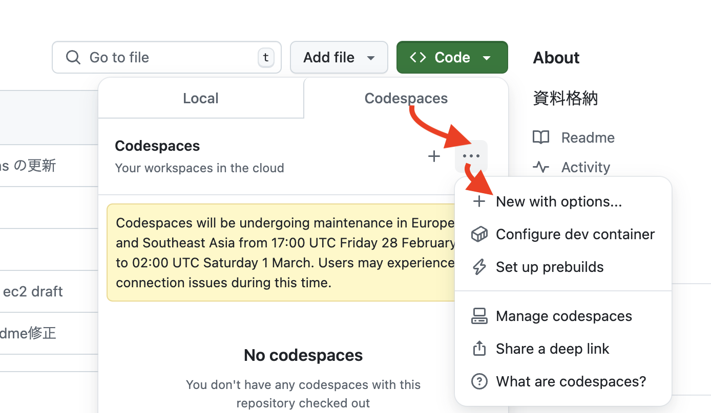
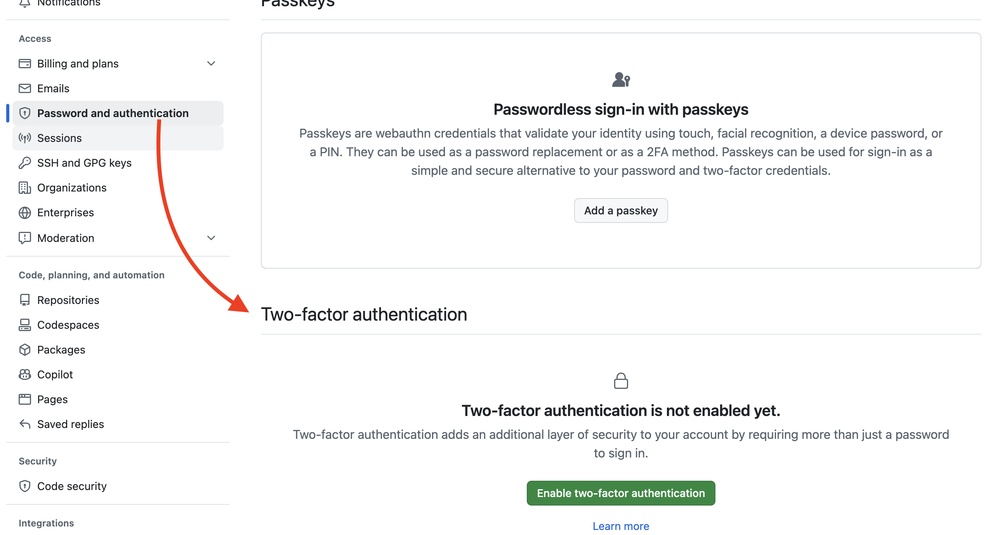

https://ghcertified.com/questions/

## 問題1 
- [x] GitHubアカウントの種類（3種類）
### 解説
- Personal accounts(個人アカウント)
  - 個人が使用するアカウント
  - 無料プランや有料プランがあり、プライベートリポジトリやチーム向けの機能も利用可能
  - 
- Organization accounts(組織アカウント)
  - チームや企業が共同作業をするためのアカウント
  - メンバー管理やリポジトリの権限設定など、チーム向けの機能が充実
  - 無料プラン、有料プランがある
  - 
  - https://genesis-tech.jp/blog/create-github-organization/
- Enterprise accounts(エンタープライズアカウント)
  - 大規模な企業向けのアカウント
  - GitHub Enterprise Cloud や GitHub Enterprise Server を利用できる

## 問題2
- [x] 適応性の高いスプレッドシート、タスク ボード、ロードマップの目的を果たすものはどれですか。GitHubの問題やプルリクエストと統合され、作業を効果的に計画および追跡します。
### 解説
- GitHub Project
  - 従来の Projects (Classic) から進化し、より柔軟にタスク管理ができる
  - 企業や個人がIssueやPullRequestと連携してプロジェクト管理を行うのに最適なツールです
  - 

## 問題3
- [x] GitHubプロジェクト、問題、プルリクエスト間の同期はどのように機能しますか?
### 解説
- IssueやPull Requestの更新はGitHub Projectsに自動的に反映され、逆方向の同期も行われる。

## 問題4
- [x] GitHubプロジェクトのアイテムのカスタムフィールドの追加の際の特徴は?
### 解説
- カスタムフィールドを使用すると、ターゲット日付やイテレーションなど、組み込みオプション以外のメタデータを追加できます。

## 問題5
- [x] GitHubプロジェクトボードに問題やプルリクエストを追加するために使用できるさまざまなオプションは何ですか?
### 解説
- 個別・・・必要な Issue や Pull Request を手動で選択し、プロジェクトに追加
- 自動・・・プロジェクトワークフロー を設定すると、特定の条件を満たす Issue や Pull Request を自動でプロジェクトに追加
- 一括・・・複数の Issue や Pull Request を 一括選択して追加

## 問題6
- [x] GitHub Projectで使用できるレイアウトはどれですか?
### 解説
- Table layout
  - 
- Board layout
  - 
- Roadmap layout
  - 

## 問題7
- [x] どのGitHub Projectレイアウトがカンバンボードとして最適ですか?
### 解説
- Board layout

## 問題8
- [x] GitHub Projectに組み込まれているステータスの自動化は何か?
### 解説
- Project内の問題またはプルリクエストがクローズ→ステータス完了
- Project内のプルリクエストがマージ→ステータス完了
- 

## 問題9
- [x] GitHubプロジェクトでの操作を自動化できるオプションは何ですか?
### 解説
- Project workflows
  - GitHub Projects の組み込み機能で、特定の条件を満たしたときに自動でアクションを実行
- GitHub Actions
  - GitHub の CI/CD 自動化ツールを使って、プロジェクトのワークフローをさらに拡張できる
- GitHub GraphQL API (API連携)
  - API を使ってプログラムでプロジェクトを操作できる

## 問題10
- [x] GitHubプロジェクトと GitHubプロジェクトクラシックの違いは何ですか?
### 解説
- GitHubプロジェクトは、従来のGitHubプロジェクトに比べて多くの新機能と改善点を提供する新しいGitHubエクスペリエンス

## 問題11
- [x] ラベルの使用例は何ですか?
### 解説
- イシュー、プルリクエスト、ディスカッションの分類
- 

## 問題12
- [x] リポジトリ所有者がマイルストーンを使用する理由は何ですか?
### 解説
- プロジェクトフェーズを完了するためにどれだけの作業が残っているかの概要を把握する
- イシューとプルリクエストを特定のプロジェクトフェーズに関連付ける
- イシュー、プルリクエストの画面から作成することができる
- 

## 問題13
- [x] 問題またはプルリクエストに人を割り当てるにはどうすればよいですか?
### 解説
- サイドバーの担当者フィールドを使用する
- 

## 問題14
- [x] 問題またはプルリクエストに同じコメントセットを頻繁に書き込む場合、時間を節約するためにどのGitHub機能を使用しますか?
### 解説
- 返信テンプレート
- users > settingsから作成できる
- 

## 問題15
- [x] 「保存された返信」はどこで作成され、どこで利用できるか?
### 解説
- 保存された返信は、GitHub アカウント設定の [保存された返信] セクションで作成、編集、削除できる
- 保存された返信は、イシューやプルリクエストで再利用できる

## 問題16
- [x] リポジトリテンプレートに関して実行できるアクションにはどのようなものがありますか?
### 解説
- リポジトリテンプレートから新しいリポジトリを作成する
- 既存のリポジトリからリポジトリテンプレートを作成する
- 

## 問題17
- [x] GitHubプロジェクトのどの機能を使用すると、プロジェクトの現在のステータスと履歴の進行状況を視覚化するためのグラフとチャートを簡単に生成できますか?
### 解説
- Project Insights
  - Project Insightsは、GitHub Projects 内でプロジェクトの進捗やタスクの状態を可視化するための機能
  - グラフやチャートを自動生成し、現在の状態や過去の履歴を簡単に確認できる
  - 

## 問題18
- [x] GitHubの継続的インテグレーションおよび継続的デリバリー (CI/CD) プラットフォームの名前は何ですか?
### 解説
- GitHub Actions
  - `/.github/workflows/`に`.yml`ファイルとしてワークフローの設定ファイルが格納される

## 問題19
- [x] GitHub Actionsの一般的な使用例は何か?
### 解説
- プルリクエストをマージする前に自動テストを実行する

## 問題20
- [x] GitHub Action ワークフローはイベントによってトリガーされます。GitHub Actions がサポートする主要なイベントは何か?(2つ)
### 解説
- コミットがブランチにプッシュされた
- プルリクエストが開かれた
- https://docs.github.com/en/actions/using-workflows/events-that-trigger-workflows#about-events-that-trigger-workflows

## 問題21
- [x] 公開されている GitHub Actions はどこにありますか?
### 解説
- GitHub Marketplace
  - 左上のアイコン > Marcketplaceからアクセスできる
  - 

## 問題22
- [x] 次のツールのうち、コード入力時にオートコンプリートスタイルの提案を提供するAIペアプログラマーとして機能するものはどれですか?
### 解説
- GitHub Copilot
  - VSCodeで使用する場合は`GitHub Copilot`拡張機能をインストールする
  - 
  - 利用状況や利用プランはsettingsから確認可能
  - 

## 問題23
- [x] GitHub Copilotは無料で使用できますか?
### 解説
- 認証済みの学生、教師、または人気のあるオープンソースプロジェクトのメンテナーであれば無料
- 無料プランは、1か月あたり 2,000 回のコード補完と 50 件のチャットメッセージに制限

## 問題24
- [x] GitHub Copilot IndividualとGitHub Copilot Businessの違いは何ですか?
### 解説
- GitHub Copilot Individual:
  - 個人アカウント向けのプラン
  - 個人ユーザーが VS Code や JetBrains などで AI 補完を利用可能
  - 価格: $10/月（または $100/年）（学生・教育者・OSSメンテナーは無料）
- GitHub Copilot Business:
  - 企業や組織向けのプラン
  - 組織内のメンバーが Copilot を利用できるようにライセンス管理可能
  - 価格: $19/ユーザー/月
  - データの取り扱いが異なり、企業のコードを学習データとして利用しない（セキュリティ面での配慮）。

## 問題25
- [x] GitHub Copilotサブスクリプションをアクティブ化した後、どのようにして GitHub Copilot の使用を開始できますか?
### 解説
- Visual Studio CodeやJetBrainsなどのサポートされているIDEのいずれかでGitHub Copilotをセットアップし、コーディングを開始

## 問題26
- [x] GitHub Codespace とは何ですか?
### 解説
- リポジトリ専用に設定された事前構成済みの開発環境
- ローカル開発環境を設定しなくても、プロジェクトのコードをすぐに書き始めることができる
- 

## 問題27
- [x] リポジトリへの貢献に必要なすべてのツールと依存関係がインストールされた、事前構成された開発環境を作成できる GitHubの機能はどれですか?
### 解説
- GitHub Codespaces
  - 開発者がすぐにコーディングを開始できる「事前構成された開発環境」を提供する機能

## 問題28
- [x] リポジトリ貢献者が Web ブラウザーから直接簡単なコード変更を行える GitHub の機能はどれですか?
### 解説
- GitHub Codespaces
  - クラウドベースの VS Code 環境で、より高度なコード編集が可能
  - リポジトリごとに事前構成された開発環境をセットアップでき、依存関係もインストールされた状態で作業できる
  - github.dev よりも強力で、フル機能の IDE 環境を提供
  - ブラウザまたはローカルの VS Code からアクセス可能
- github.dev editor
  - GitHub の Web エディタ（github.dev）を使えば、ブラウザ上でコードを簡単に編集可能
  - リポジトリのコードを編集する際に `.`（ドット）キーを押すだけで、github.dev エディタが開く
  - 軽量な VS Code の Web 版のような UI で、簡単な修正ができる
  - ローカル開発環境のセットアップ不要

## 問題29
- [ ] GitHub Codespace のライフサイクル フェーズにはどのようなものがありますか?
### 解説
- Create, Rebuild, Stop, Delete
- 
- https://dev.to/learnwithsrini/code-with-github-codespaces-4hbh

## 問題30
- [x] GitHub Codespace 環境を停止した場合、コミットしていない変更を後で元に戻すことができますか?
### 解説
- はい、これはGitHub Codespaceを停止してから起動するときのデフォルトの動作です。
  - GitHub Codespaces では、環境を停止しても未コミットの変更は保持される
  - 停止した Codespace を再開すれば、作業内容はそのまま復元される
  - クラウド上に環境が保存されるため、ローカル PC をシャットダウンしても作業を継続できる
  - ただし、一定期間経過すると Codespace が削除される可能性があるので、重要な変更は適切にコミットしておくのがベスト

## 問題31
- [x] GitHub Codespaces ライフサイクルに関する次の記述のうち、正しいものはどれですか? 
### 解説
- Codespace のライフサイクルは、Codespace の作成時に開始され、削除時に終了
  - Codespace は作成時に開始し、明示的に削除しない限り存続
  - 停止や一時切断は可能だが、削除しない限り復元可能
- プロジェクトに加えた変更を失うことなく、Codespace を停止して再起動できる
  - ブラウザを閉じたり、ネットワークが切断されたりしても、Codespace は動作を続ける
  - 再接続すれば、実行中のプロセスもそのまま継続される
- 実行中のプロセスに影響を与えることなく、アクティブな Codespace を切断して再接続できます
  - GitHub Codespaces を停止しても、未コミットの変更は保持される
  - 再開すれば、作業内容が復元されるので、すぐに続きから作業を始められる。

## 問題32
- [x] GitHub Codespace 環境に割り当てられる CPU コアの量をカスタマイズできますか?
- はい、コードスペースを作成するとき、またはコードスペースを作成した後いつでも、別のマシン タイプを選択できます。
  - GitHub Codespaces では、作成時または作成後に使用するマシンタイプを変更可能
  - CPU コア数、メモリ、ストレージの異なるマシンを選択できる
  - 必要に応じて、より高性能なマシンを選択してプロジェクトに適した環境を用意できる
  - 変更は GitHub の UI または codespace CLI で行うことができる
  - New with options... でコア数の指定などして作成することができる
  -  

## 問題33
- [x] GitHub Codespaces で実行される環境をカスタマイズするにはどうすればよいですか?
### 解説
- `.devcontainer/devcontainer.json`ファイルを作成する
-  

## 問題34
- [x] GitHub Codespace ディープリンクとは何ですか?
### 解説
- 新しい GitHub Codespace を作成し、特定の構成を選択できる特定の GitHub.com ページを指すリンク
  -  
  - このリンクを開くと、使用するマシンのスペックやブランチの選択などのカスタマイズが可能
  -  
  - 例えば、あるリポジトリの特定のブランチを開く Codespace Deep Link を作成できる。

## 問題35
- [x] GitHub で 2 要素認証（2FA：Two-Factor Authentication）を有効にすべきなのは誰ですか?
### 解説
- **すべてのGitHubユーザー**
- ユーザのSettings から二要素認証の設定ができる
-  

## 問題36
- [x] エンタープライズ管理ユーザー（Enterprise Managed Users: EMU）とは何ですか?
### 解説
- Azure AD や Okta などの外部 ID プロバイダーからのユーザーアクセスを管理できる GitHub Enterprise 機能
  - Enterprise Managed Users（EMU）は、**GitHub Enterprise Cloud**の機能
  - **外部の ID プロバイダー（IdP）**、例えば Azure Active Directory（Azure AD）や Okta などを利用して、ユーザーアカウントを管理できる
  - **企業や大規模組織で、アカウント管理を一元化**し、アクセス制御を厳格にするために利用される
  - **GitHubではアカウントの作成や管理を行わず**、すべての管理が IdP で行われる。

## 問題37
- [x] 個人アカウントが所有するリポジトリのさまざまな権限レベルは何ですか?
### 解説
-  個人アカウントが所有するリポジトリには、リポジトリ所有者とコラボレータの 2 つの権限レベルがあります。
- repository owner(リポジトリ所有者)
  - **リポジトリの管理権限を持つ最上位のユーザー**
  - リポジトリに対するアクセス権の管理、コラボレータの追加、設定の変更など、すべての権限を持つ
  - リポジトリ所有者はそのリポジトリの作成者であり、通常はリポジトリの最終的な管理者となる
- collaborator（コラボレータ）
  - **リポジトリ所有者が特定のユーザーに付与する権限**
  - リポジトリに対するフルアクセス権を持つ場合もあれば、読み取り専用の権限を持つ場合もある
  - リポジトリ所有者は他のユーザーにコラボレータとして追加することができる
  - コラボレータは、各リポジトリのSettingsから招待できる
  -   

## 問題38
- [x] GitHub Organizationの役割（ロール）は？（6ロール）
### 解説
- Owner(所有者)
- Member(メンバー)
- Moderator(モデレータ)
- Billing manager(支払いマネージャー)
- Security manager(セキュリティマネージャー)
- Outside collaborator(外部コラボレータ)
- 各ロールは下記参照
- https://docs.github.com/ja/organizations/managing-peoples-access-to-your-organization-with-roles/roles-in-an-organization#permissions-for-organization-roles

## 問題39
- [x] リポジトリのイシュータブ(Issue tab)を無効にできますか?
### 解説
- はい
  - 貢献やバグレポートを受け入れない場合は、リポジトリのイシューをオフにすることをお勧めします
  - 各リポジトリのSettings > General > Features から設定可能
  - 

##　問題40
- [ ] 自分が所有するリポジトリの問題、Wiki、プロジェクトなどのリポジトリ機能を無効にできる場所はどこですか?
- リポジトリ設定

- [ ] 41. リポジトリのさまざまな可視性オプションは何ですか?
- Private
- Public
- Internal (Enterpriseのみ)

- [ ] 42. `CODEOWNERS`ファイルの目的は何ですか?
- コードベースの特定の領域または全体を担当する個人またはチームを定義できる

- [ ] 43. プルリクエストを`main`ブランチにマージする前に、ステータスチェックに合格するように強制するにはどうすればよいですか?
- ブランチ保護ルールを作成する
- https://zenn.dev/json_hardcoder/articles/f9b534377103a4

- [ ] 44. 次のアクションのどれを実行すると、`main`ブランチにプッシュする前に、変更が少なくとも2人の承認を受けていることが保証されますか? 
- メインブランチのブランチ保護ルールを作成する
- ブランチ保護ルールでは、マージ前にプルリクエストを要求します
- ブランチ保護ルールでは、プルリクエストをマージする前に少なくとも2つの承認を要求します

- [ ] 45. リポジトリのセキュリティタブには何がありますか?
- 依存関係の脆弱性、コードスキャン結果、シークレットスキャンアラートなど、そのリポジトリのセキュリティ概要

- [ ] 46. CodeQLとは何ですか?
- コード分​​析ツール

- [ ] 47. リポジトリの依存関係を最新の状態に保つのに役立つツールはどれですか?
- Dependabot

- [ ] 48. リポジトリインサイトとは何ですか?
- コード頻度、最もアクティブな貢献者のリストなど、リポジトリに関するデータを表示できる場所

- [ ] 49. リポジトリの共同作業者(collaborators)とは?
- リポジトリへの書き込みアクセス権を付与されたユーザー

- [ ] 50. 個人のGitHubアカウントで作成したリポジトリで、友人と共同作業するにはどうすればよいでしょうか?
- リポジトリ設定に移動し、共同編集者として招待する

- [ ] 51. GitHub teamsとは何ですか?
- 同じ組織（organization）のGitHubユーザーのグループ

- [ ] 52. 組織のモデレーターの役割は何ですか?
- モデレーターは、メンバーとしての権限に加えて、非メンバーの貢献者のブロックとブロック解除、インタラクション制限の設定、組織が所有するパブリックリポジトリでのコメントの非表示が許可されている組織メンバーです。

- [ ] 53. 組織のセキュリティマネージャーの役​​割は何ですか?
- セキュリティマネージャーは、組織のメンバーであり、セキュリティアラートを表示したり、組織全体のコードセキュリティの設定を管理したり、組織内のすべてのリポジトリの読み取り権限を持つことができます。

- [ ] 54. 次の定義のうち、オープンソースソフトウェアを最もよく表しているのはどれですか?
- 誰でも検査、変更、拡張できるソースコード付きのソフトウェアです。

- [ ] 55. GitHubスポンサープログラムとは何ですか?
- 

- [ ] 56. 個人のGitHubダッシュボードで、ユーザー`octocat`が新しいリポジトリ`octocat/my-repo`を作成したという通知を受け取りました。なぜその通知を受け取ったのですか?

- [ ] 57. GitHubでユーザーをフォローするとどのような影響がありますか?

- [ ] 58. GitHub Marketplaceとは何ですか?

- [ ] 59. InnerSourceとは何ですか?

- [ ] 60. 組織内のさまざまなチーム間でのコードのコラボレーション、可視性、共有を促進する方法はどれですか?

GitHub のフォークとは何ですか?
リポジトリを見つけやすくするには、次のどれが役立ちますか? 
バグ レポートを送信したり、リポジトリに新しい機能を提案したりしようとしているユーザーが入力する情報を理解できるように、ガイド プロトコルをどのように定義できますか?
プル リクエスト テンプレートとは何ですか?
バージョン管理システムを最もよく表しているのはどれですか?
分散バージョン管理システムにおける「分散」という言葉の意味は何ですか?
git について最もよく説明されているのは次のどれですか?
GitHub について最もよく説明されているのは次のどれですか?
Git と GitHub の関係は何ですか?
GitHub のリポジトリとは何ですか?
git コミットとは何ですか?
開発者が互いに競合することなく同じコードベースで同時に作業できるようにするのはどの Git 機能ですか?
GitHub Flow とは何ですか?
GitHub Pro プランとは何ですか?
組織向けの GitHub の無料バージョンはありますか?
組織アカウント向けのさまざまな GitHub 料金プランは何ですか? 
GitHub のセルフホスト型デプロイメントを提供する GitHub 料金プランはどれですか?
どの GitHub 料金プランで、無制限の数のパブリック リポジトリを作成できますか?
GitHub Enterprise のさまざまなデプロイメント オプションは何ですか?
GitHub Enterprise デプロイメント オプションに関する次のどのステートメントが正しいですか?
GitHub の固定リポジトリとは何ですか?次のファイルのうち、GitHub プロファイルをカスタマイズできるのはどれですか?
GitHub の問題やプル リクエストにコメントを書くときに使用する言語は何ですか?
GitHub のスラッシュ コマンドとは何ですか?
適切な問題やプル リクエストのコメントを書きたいが Markdown 構文を知らない人に対して、GitHub はどのように役立ちますか?
GitHub Desktop とは何ですか?
GitHub Mobile とは何ですか?
プル リクエストを問題にリンクするにはどうすればよいですか?
問題フォームによって問題テンプレートよりもどのような改善がもたらされますか?
次のうち、会話、質問、アナウンスの投稿、アイデアの共有を行うコミュニティ フォーラムとして使用されるリポジトリ機能はどれですか?
プル リクエストの説明に `Closes #11` という行を追加すると、どのような効果がありますか?
GitHub では、あるブランチから別のブランチに変更のセットをマージする提案は次のように呼ばれます:
ブランチ `feature-a` から `main` に変更をマージし、プル リクエストを作成しています。どのブランチを `base` ブランチにし、どのブランチを `compare` ブランチにする必要がありますか?
ドラフト プル リクエストとは何ですか?
プル リクエスト レビューのステータスにはどのようなものがありますか? 
問題とディスカッションの違いに関する次の記述のうち、正しいものはどれですか?
小さなコード スニペットを他のユーザーと簡単に共有するのに最適な GitHub 機能はどれですか?
GitHub Wiki とは何ですか?
プロジェクトを使用する必要がなくなった場合に利用できる 2 つのオプションは何ですか?
作成後に gist をパブリックからシークレットに変更できますか?
プロジェクトを閉じることを選択した場合、どうなりますか?
GitHub リポジトリに複数の Readme.md ファイルがある場合、それらを表示する優先順位は何ですか?
次の Git コマンドのうち、1 行で新しいブランチを作成し、作業を開始できるのはどれですか?
GitHub ディスカッションが問題に変換され、問題が閉じられるか、対応する # 番号を使用して参照された場合、ディスカッションは変更されますか?
リポジトリの Insights タブの Pulse セクションに表示される情報はどれですか?
GitHub 組織階層にはどのようなレベルがありますか? 
組織の課金を設定したり、課金マネージャーを割り当てたりできるのは誰ですか? 
GitHub 認証に標準のユーザー名とパスワードではなく、個人アクセス トークン (PAT) を使用する主な利点の 1 つは何ですか?
GitHub でサポートされている 2 要素認証または多要素認証のさまざまな形式は何ですか?
個人アカウントのさまざまな GitHub 料金プランは何ですか?
個人アカウントと組織アカウントの両方に共通する GitHub の料金プランは何ですか?
タスク リストを作成するために GitHub Markdown で使用される構文は何ですか?
構文と正しくペアリングされていない Markdown 要素はどれですか?
github.com と比較して、GitHub Desktop に固有の機能は何ですか?
次のアクションのうち、GitHub Desktop から直接実行できないものはどれですか?
組織内のプロジェクト テンプレートに関して実行できるアクションにはどのようなものがありますか?
GitHub wiki について正しいのは次のどれですか?
GitHub の組織レベルのリポジトリで使用できるロールは次のどれですか?
組織が所有するリポジトリにコミットを直接プッシュするためにユーザーが持つ必要のある最小限の権限は何ですか?
組織内の GitHub Actions に関して、セキュリティ マネージャーが持つ機能はどれですか?
リポジトリのアクティビティと健全性に関する事前構築されたグラフまたは視覚化を提供する機能はどれですか?
GitHub Copilot for Business にはあって GitHub Copilot for Individuals にはない機能はどれですか?
組織が所有するリポジトリの組織メンバーと外部のコラボレーターの主な違いは何ですか?
次のアクションのうち、GitHub ディスカッションで実行できるのはどれですか?
本文に「fix」と記載されている、`test` というラベルの付いたすべてのオープン イシューを検索する検索クエリはどれですか?
次のどれが GitHub のプル リクエストの有効な状態ですか?
新しい GitHub プロジェクトと GitHub プロジェクト Classic の主な違いを最もよく表している記述はどれですか?
次のどれが Codespaces `.devcontainer/devcontainer.json` 構成ファイルでカスタマイズできますか? 
組織内のどのロールがプライベート リポジトリのセキュリティ アラートを表示および管理できますか?
次の記述のうち、GitHub の個人アカウントと組織アカウントの違いを正確に表している記述はどれですか?
リポジトリのクローン作成とリポジトリのフォークの違いを最もよく表している記述はどれですか?
GitHub プロフィールのピン留めされたアイテムに関する次の記述のうち、正しいものはどれですか?
名前に「docker」を含む、100 個を超えるスターを持つパブリック リポジトリを検索するには、どの高度な検索演算子の組み合わせを使用しますか?
次のどれが GitHub シークレット スキャンを最もよく説明していますか?
GitHub Pages に関する次の記述のうち、正しいものはどれですか?